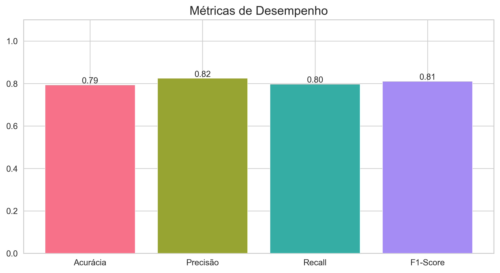
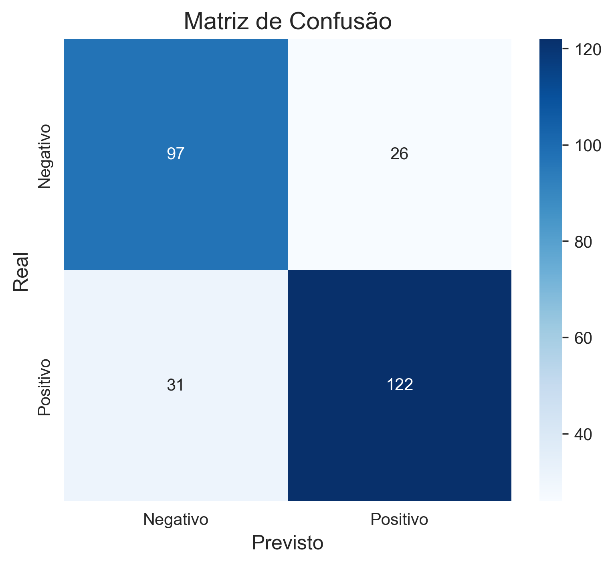
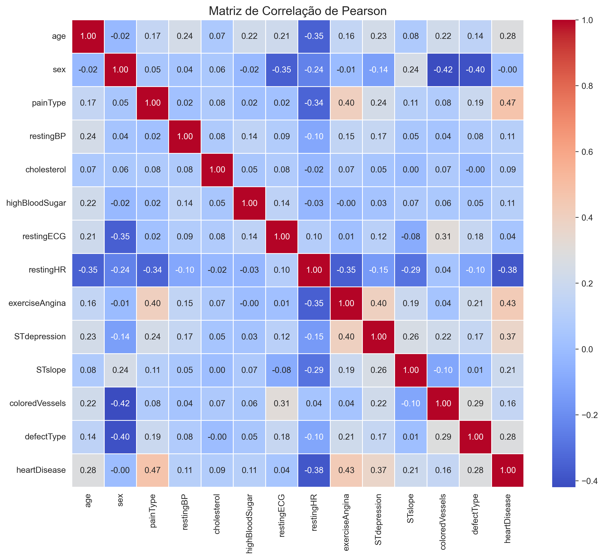
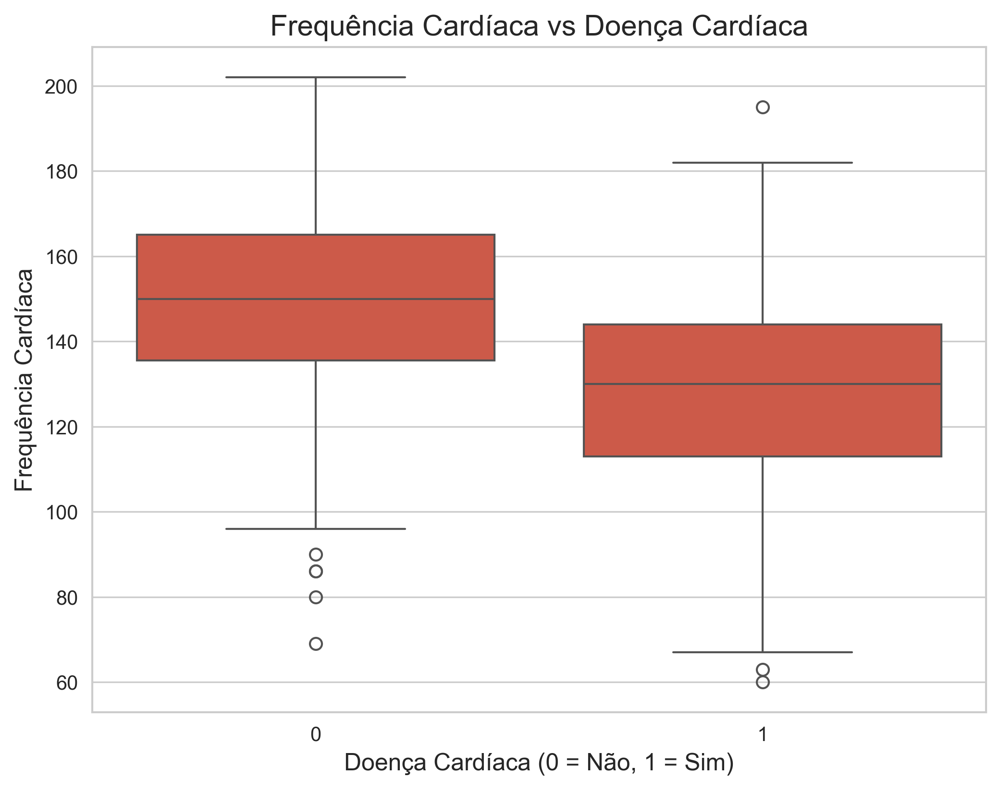
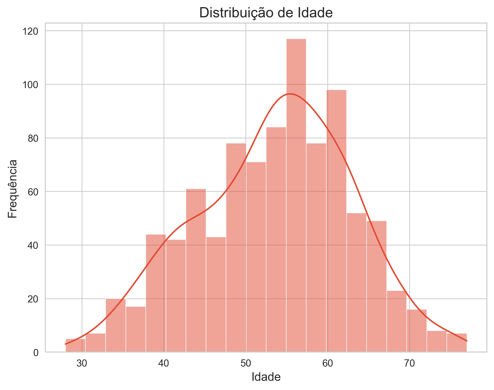
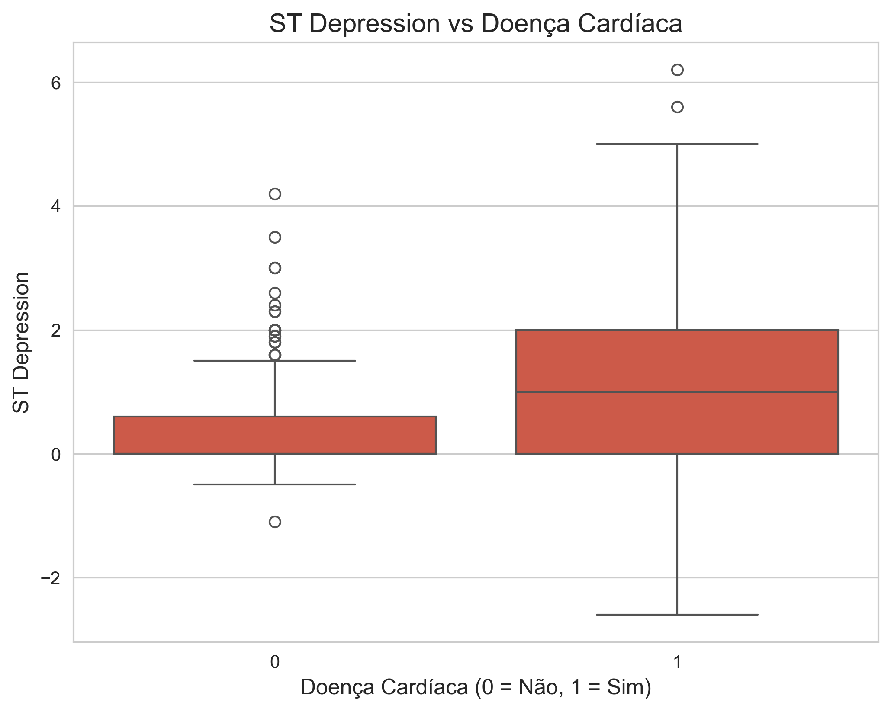
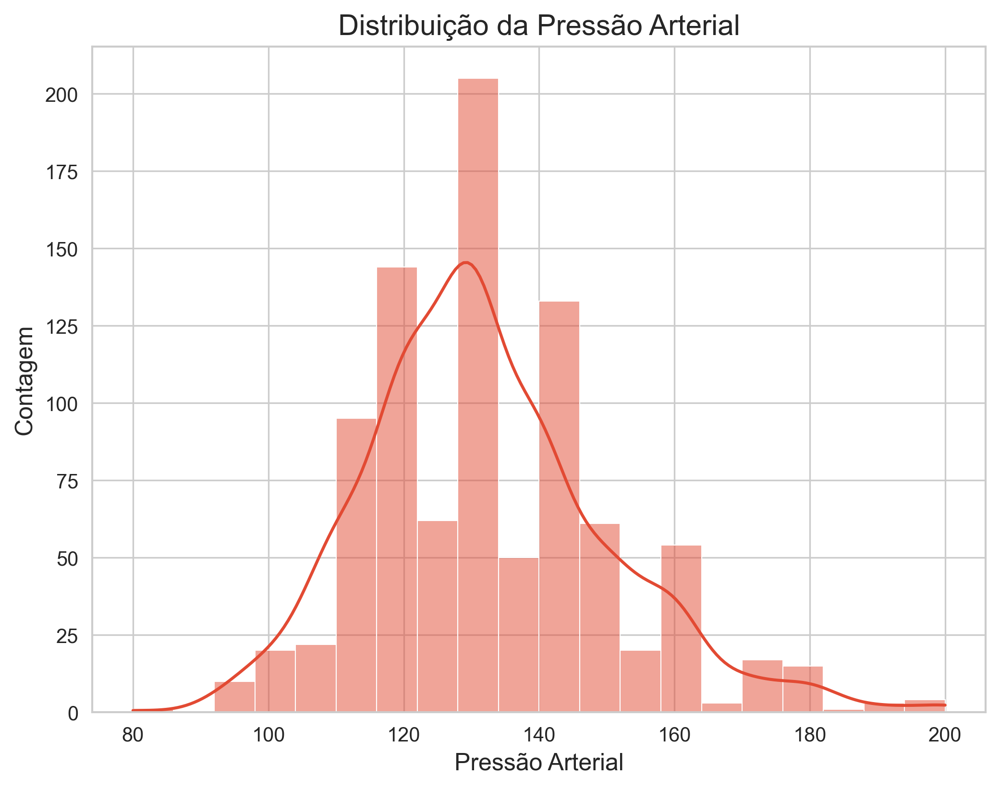
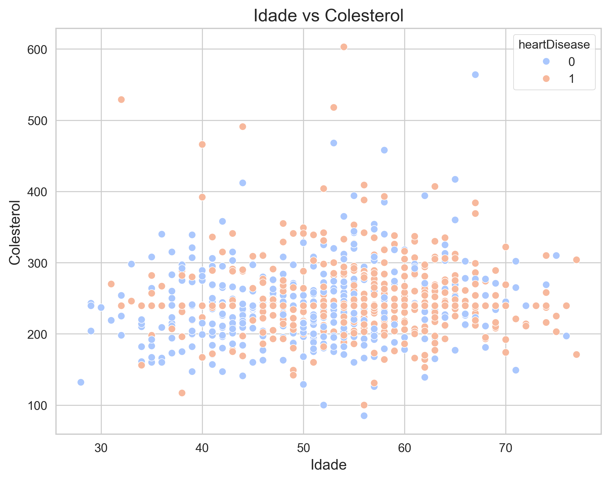
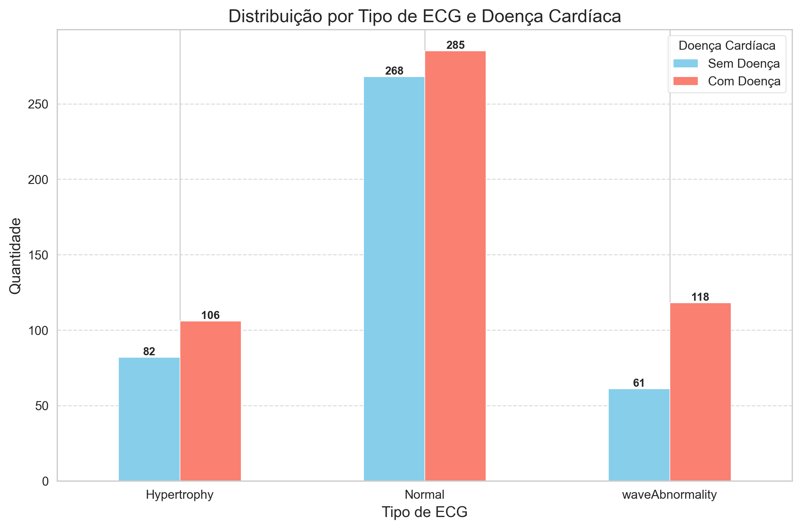
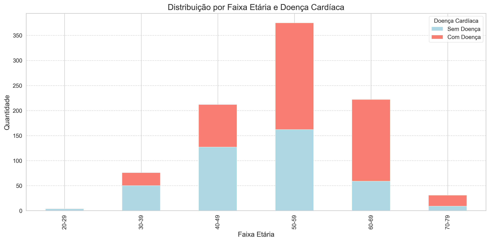

# Análise de Dados Cardíacos com Machine Learning


Este projeto realiza uma análise completa de dados cardíacos utilizando algoritmos de machine learning para prever doenças cardiovasculares, acompanhada de visualizações gráficas significativas.

## 📌 Visão Geral

O repositório contém:
- Pré-processamento de dados cardíacos
- Modelagem preditiva com KNN
- Análise visual através de 11 gráficos diferentes
- Geração automática de relatório em PDF

## 📊 Gráficos Gerados

### 1. Métricas de Desempenho

- Comparação visual das métricas do modelo (Acurácia, Precisão, Recall, F1-Score)

### 2. Matriz de Confusão

- Visualização dos acertos e erros do modelo

### 3. Matriz de Correlação

- Análise das relações entre variáveis do dataset

### 4. Frequência Cardíaca vs Doença

- Distribuição da frequência cardíaca em pacientes com/sem doença

### 5. Distribuição por Idade

- Histograma da distribuição etária dos pacientes

### 6. ST Depression vs Doença

- Relação entre depressão do ST e presença de doença cardíaca

### 7. Pressão Arterial

- Distribuição dos valores de pressão arterial

### 8. Idade vs Colesterol

- Dispersão entre idade e níveis de colesterol

### 9. ECG em Repouso

- Distribuição por tipo de ECG e presença de doença

### 10. Distribuição por Faixa Etária

- Quantidade de pacientes por faixa etária

### 11. Doença por Faixa Etária

- Distribuição de doença cardíaca por faixa etária

## 🤖 Algoritmos Utilizados

```python
Pipeline([
    ('preprocessor', ColumnTransformer([
        ('num', StandardScaler(), numeric_cols),
        ('cat', OneHotEncoder(), categorical_cols)
    ])),
    ('classifier', KNeighborsClassifier())
])
```

**Métricas obtidas:**
- Acurácia: 0.7935
- Precisão: 0.8243
- Recall: 0.7974
- F1-Score: 0.8106

## 🛠️ Como Executar

1. Clone o repositório:
```bash
git clone https://github.com/duhansen/heart.git
cd analise-cardio
```

2. Instale as dependências:
```bash
pip install -r requirements.txt
```

3. Execute o script principal:
```bash
python index.py
```

4. O relatório completo será gerado em:
```
relatorio_cardiaco_completo.pdf
```

## 📝 Dependências

- Python 3.8+
- pandas
- scikit-learn
- matplotlib
- seaborn
- fpdf2
- numpy

## 📈 Insights Principais

1. Pacientes com maiores valores de ST depression têm maior probabilidade de doença cardíaca
2. A faixa etária entre 50-59 anos apresenta maior incidência de problemas cardíacos
3. Resultados anormais no restingECG estão fortemente correlacionados com diagnóstico positivo
4. O modelo KNN alcançou 79.35% de acurácia na predição

## 🤝 Contribuição

Contribuições são bem-vindas! Siga os passos:
1. Faça um fork do projeto
2. Crie sua branch (`git checkout -b feature/AmazingFeature`)
3. Commit suas mudanças (`git commit -m 'Add some AmazingFeature'`)
4. Push para a branch (`git push origin feature/AmazingFeature`)
5. Abra um Pull Request

## 📄 Licença

Distribuído sob a licença MIT. Veja `LICENSE` para mais informações.
